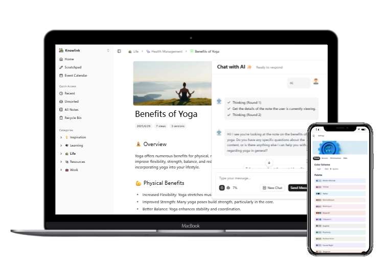

<a id="readme-top"></a>
<br />

<div align="center">
  <a href="https://github.com/othneildrew/Best-README-Template">
    
  </a>

  <h3 align="center">Knowlink</h3>

  <p align="center">
    Your personal AI-powered note and bookmark manager.
    <br />
    <a href="https://hlint.github.io/knowlink"><strong>Explore the docs »</strong></a>
    <br />
    <br /> 
		<a href="./README_ZH.md">中文</a>
		&middot;
    <a href="https://github.com/hlint/knowlink/issues/new?labels=bug&template=bug-report---.md">Report Bug</a>
    &middot;
    <a href="https://github.com/hlint/knowlink/issues/new?labels=enhancement&template=feature-request---.md">Request Feature</a>
  </p>
</div>

## About The Project



Knowlink is designed to be your personal knowledge management solution:

- **Simple & Focused**: Streamlined text content management without unnecessary complexity
- **Smart Organization**: AI-powered categorization that eliminates the need to manually organize your thoughts
- **Seamless AI Integration**: Intelligent assistance that works naturally in the background
- **Cross-Platform Access**: Access your knowledge base from any device, anywhere

## Try It Now

```bash
docker run -d --name knowlink -p 3000:3000 hlint/knowlink:latest
```

Don't have Docker installed? Try [Play with Docker](https://labs.play-with-docker.com/) - a free online platform that provides temporary Linux environments for Docker testing.

<p>(<a href="#readme-top">back to top</a>)</p>
